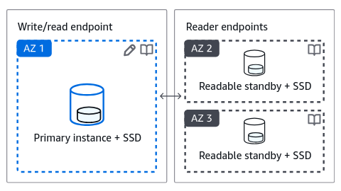

# Create a database on Amazon Relational Database Service (Amazon RDS)

## 1. Introduction

> [!NOTE]
> For _deployment type_ (aka _deployment option_), in additional to the 2 options:
>
> - Standalone, aka `Single AZ DB instance (1 instance)`
>
>   This creates a single DB instance without standby instances.
>
>   
>
> - Multi-AZ, aka `Multi-AZ DB instance (2 instances)`
>
>   This creates a primary DB instance with a non-readable standby instance in a separate Availability Zone
>
>   
>
> From 2022 there is a new option:
>
> - `Multi-AZ DB cluster (3 instances)`
>
>   This creates a primary DB instance with two readable standbys in separate Availability Zones
>
>   
>
> See
>
> - [Introducing a new Amazon RDS Multi-AZ option with up to 2x faster transaction commit latency, automated failovers typically under 35 seconds, and readable standby instances](https://aws.amazon.com/about-aws/whats-new/2022/03/amazon-rds-multi-az-transaction-commit-latency/)
> - [Amazon RDS Multi AZ Deployments | Cloud Relational Database | Amazon Web Services](https://aws.amazon.com/rds/features/multi-az/)
> - [Choose the right Amazon RDS deployment option: Single-AZ instance, Multi-AZ instance, or Multi-AZ database cluster | AWS Database Blog](https://aws.amazon.com/blogs/database/choose-the-right-amazon-rds-deployment-option-single-az-instance-multi-az-instance-or-multi-az-database-cluster/)

> [!NOTE]
> From 2023, AWS RDS support a new database engine: IBM db2.
>
> See:
>
> - [Getting started with new Amazon RDS for Db2 | AWS News Blog](https://aws.amazon.com/blogs/aws/getting-started-with-new-amazon-rds-for-db2/)
> - [IBM Db2 is now available on Amazon RDS](https://www.ibm.com/new/announcements/ibm-db2-is-now-available-on-amazon-rds)

## 2. Preparation steps

### 2.1 Create a VPC

### 2.2 Create EC2 Security Group

### 2.3 Create RDS Security group

### 2.4 Create DB Subnet Group

## 3. Create EC2 instance

> [!TIP]
> If you're using AWS Free Tier, for `DB instance class`, choose `db.t2.micro` instance (or `db.t3.micro`/`db.t4g.micro` instance, ) to be eligible for RDS Free Tier.

## 4. Create RDS database instance

## 5. Application Deployment

> [!NOTE]
> After cloning, [GitHub - AWS-First-Cloud-Journey/AWS-FCJ-Management](https://github.com/AWS-First-Cloud-Journey/AWS-FCJ-Management), you need to
>
> - change directory to `AWS-FCJ-Management`
> - then run the script to install `node.js`

> [!TIP]
> The `DB_NAME` is the name of the database you created with `mysql` client (not the name of the RDS instance).
>
> - In this workshop, the `DB_NAME` is `first_cloud_users` as in [later step](https://000005.awsstudygroup.com/5-deploy-app/#using-database) in this section

> [!TIP]
> Instead of using MySQL command-line client, you can
>
> - use MariaDB client, which can be installed on Amazon Linux 2023 with the following command:
>
>   ```bash
>   sudo dnf install mariadb105
>   ```
>
> - then connect to the database with the same command:
>
>   ```bash
>   mysql -h $DB_HOST -P 3306 -u $DB_USER -p $DB_PASS
>   ```
>
> See: [Installing the MySQL command-line client - Amazon Relational Database Service](https://docs.aws.amazon.com/AmazonRDS/latest/UserGuide/mysql-install-cli.html)

> [!TIP]
> To exit from MySQL command-line client, you can use `exit` command.
>
> ```bash
> exit;
> ```

> [!TIP]
> After install `Node.js`, you need to close and reopen your terminal to start using `npm` or run the following to use it now:
>
> ```bash
> source ~/.bashrc
> ```

> [!NOTE]
> When running `npm start`,
>
> - If you get the error:
>
>   ```bash
>   $ npm start
>
>   > first-cloud-users-management-app@1.0.0 start
>   > nodemon app.js
>
>   node:internal/modules/cjs/loader:451
>         throw err;
>         ^
>
>   Error: Cannot find module '/home/ec2-user/AWS-FCJ-Management/node_modules/semver/index.js'. Please verify that the package.json has a valid "main" entry
>       at tryPackage (node:internal/modules/cjs/loader:443:19)
>       at Module._findPath (node:internal/modules/cjs/loader:711:18)
>       at Module._resolveFilename (node:internal/modules/cjs/loader:1126:27)
>       at Module._load (node:internal/modules/cjs/loader:981:27)
>       at Module.require (node:internal/modules/cjs/loader:1231:19)
>       at require (node:internal/modules/helpers:177:18)
>       at Object.<anonymous> (/home/ec2-user/AWS-FCJ-Management/node_modules/nodemon/lib/utils/index.js:3:16)
>       at Module._compile (node:internal/modules/cjs/loader:1364:14)
>       at Module._extensions..js (node:internal/modules/cjs/loader:1422:10)
>       at Module.load (node:internal/modules/cjs/loader:1203:32) {
>     code: 'MODULE_NOT_FOUND',
>     path: '/home/ec2-user/AWS-FCJ-Management/node_modules/semver/package.json',
>     requestPath: 'semver'
>   }
>   ```
>
> - run `npm update --force` to update `package-lock.json`

## 6. Backup and restores

## 7. Clean up resources
